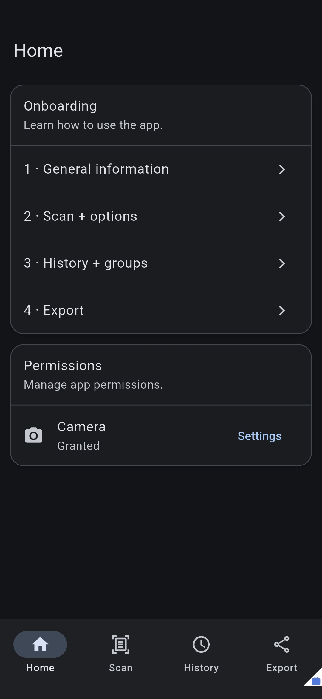
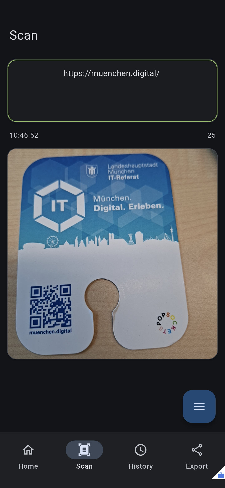
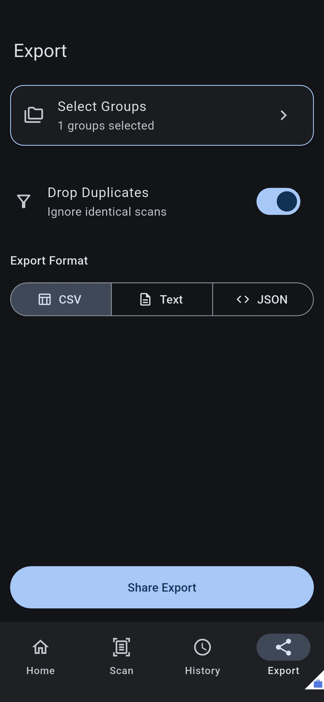

# Scanify - Cross-Platform Scanner App

[![Made with love by it@M][made-with-love-shield]][itm-opensource] [](https://opensource.org/licenses/MIT) [](https://flutter.dev/) [](#) [](https://bloclibrary.dev/) [](https://github.com/it-at-m/scanify/pulls) [](https://github.com/it-at-m/scanify) [](https://github.com/it-at-m/scanify/issues)

The **Scanify** flutter application is a powerful camera based scanner for all common QR and barcode formats. Scanify is originally developed by a student as a project at Hof Universtiy (Hochschule Hof). Camera permission is required for full functionallity.

## Screenshots

<p>
  
  
  
</p>

### Built With

- [flutter](https://flutter.dev/)
- [flutter_bloc](https://pub.dev/packages/flutter_bloc)
- [mobile_scanner](https://pub.dev/packages/mobile_scanner)

### Privacy & Data Protection

The Scanify application is built with strict privacy principles by design. It operates entirely offline and does not communicate with any backend servers. It does not upload your scanned data to the cloud and contains zero build in analytics, telemetry, or monitoring SDKs. All scanning and data storage remains strictly on your local device.

## Set up

1. Read the [Recomendation](#recommendation) and [Deployment by OS](#deployment-by-os)

2. Make sure you have a [working flutter setup](https://docs.flutter.dev/install). Check with

```bash
    flutter doctor

    Doctor summary (to see all details, run flutter doctor -v):
[✓] Flutter (Channel stable, 3.38.7, on macOS 15.7.3 24G419 darwin-arm64, locale en-US)
[✓] Android toolchain - develop for Android devices (Android SDK version 36.0.0)
[✓] Xcode - develop for iOS and macOS (Xcode 26.2)
[✗] Chrome - develop for the web (Cannot find Chrome executable at /Applications/Google Chrome.app/Contents/MacOS/Google Chrome)
    ! Cannot find Chrome. Try setting CHROME_EXECUTABLE to a Chrome executable.
[!] Connected device
    ! Error: Browsing on the local area network for iPhone 15. Ensure the device is unlocked and attached with a cable or
      associated with the same local area network as this Mac.
      The device must be opted into Developer Mode to connect wirelessly. (code -27)
[✓] Network resources

! Doctor found issues in 2 categories.
```

You can savely ignore "Cannot find Chrome" since we do not want to build a browser app. Make sure you have connected devices available in development mode to run the app on.

3. Clone the repository:

```bash
    git clone https://github.com/it-at-m/scanify.git
```

4. Navigate into the project directory.

5. [Run the app](#run-the-app)

## Documentation

### Recommendation

A macOS system was used for development (version 15.7.3). This is also recommended, because the Flutter app can be built and deployed directly to both iOS and Android test devices using macOS.

When using a Windows or Linux computer, you must accept that the app can only be deployed to Android devices.

Flutter, Dart, and Bloc are required, e.g. via VS Code extensions

- [Flutter & Dart Extension](https://marketplace.visualstudio.com/items?itemName=Dart-Code.flutter)
- [Bloc Extension](https://marketplace.visualstudio.com/items?itemName=FelixAngelov.bloc)

### Deployment by OS

The app can be deployed to the Android Emulator in Android Studio or the iOS Simulator in Xcode. To fully utilize the camera scan functionality, the app must be installed on a physical Android or iOS test device. This device must be in Developer Mode.

- [Enable Developer Mode iOS](https://developer.apple.com/documentation/xcode/enabling-developer-mode-on-a-device)
- [Enable Developer Mode Android](https://www.android.com/intl/de_de/articles/entwickleroptionen-android/)

#### Required for Android Deployment

- Windows/Mac/Linux operating system
- Android Studio or CLI
- [Please follow the official guide linked here](https://docs.flutter.dev/platform-integration/android/setup)

#### Required for iOS Deployment

- macOS operating system
- Xcode + CLI + current iOS build
- [Please follow the official guide linked here](https://docs.flutter.dev/platform-integration/ios/setup)

### Structure

The app was designed using a Feature First architecture. ([Reference](https://medium.com/@sharmapraveen91/modern-flutter-architecture-patterns-ed6882a11b7c))

In a Feature First architecture, developers organize code around the individual features of the app. This means if a new feature like Login is added in the future, it is placed in the features directory. Everything directly related to the login feature goes into the "lib/features/login" folder. The advantage of this architecture is that completed features are less likely to be negatively impacted by changes in other features.

```bash
lib/
│── features/
│   │── authentication/
│   │── dashboard/
│   │── profile/
│── core/
│── main.dart
```

#### App Icon

Depending on the platform, the app icon can be changed in these locations. The Apple Icon Composer (included in Xcode) was used to create the icons.

- Android: "android/app/src/main/res/mipmap\*"
- iOS: "ios/AppIcon.icon/Assets/icon_main.svg" & "ios/AppIcon.icon/icon.json"

#### iOS Podfile

iOS specific settings can be configured in the Podfile.

- "ios/Podfile"

### Important Commands

#### Run the app

Instead of "all", the Device ID from "flutter devices" can be specified to deploy to a specific device.

```bash
# Starts the app on all connected devices in release mode
flutter run -d all --release

# Starts the app on all connected devices in debug mode
flutter run -d all --debug

# Starts the app on all connected devices in performance profiling mode
flutter run -d all --profile
```

#### Flutter General

```bash
# Checks the Flutter installation for errors
flutter doctor

# Shows packages for which new versions are available
flutter pub outdated

# Lists all connected devices and emulators
flutter devices

# Clears the Flutter build cache
flutter clean
```

#### Code Generation (freezed & json_serializable)

This project uses `@freezed` and `json_serializable` to generate boilerplate code for models and states. If you modify any annotated files, you must run the build runner to regenerate the corresponding `.freezed.dart` and `.g.dart` files.

Run the following command in your terminal:

```bash
# Generates the required freezed and json_serializable files
dart run build_runner build --delete-conflicting-outputs
```

#### Change App Display Name and Bundle ID

```bash
# Sets the display name of the app for iOS and Android
dart run rename setAppName --targets ios,android --value "<name>"

# Sets the bundle ID for iOS and Android
dart run rename setBundleId --targets ios,android --value "<bundleid>"
```

#### Platform Configuration

These commands have already been executed to disable the app on all unneeded platforms.

```bash
# Disables macOS, Linux, and Windows
flutter config --no-enable-macos-desktop
flutter config --no-enable-linux-desktop
flutter config --no-enable-windows-desktop

# Disables Web
flutter config --no-enable-web
```

## Contributing

Contributions are what make the open source community such an amazing place to learn, inspire, and create. Any contributions you make are **greatly appreciated**.

If you have a suggestion that would make this better, please open an issue with the tag "enhancement", fork the repo and create a pull request. You can also simply open an issue with the tag "enhancement".
Don't forget to give the project a star! Thanks again!

1. Open an issue with the tag "enhancement"
2. Fork the Project
3. Create your Feature Branch (`git checkout -b feature/AmazingFeature`)
4. Commit your Changes (`git commit -m 'Add some AmazingFeature'`)
5. Push to the Branch (`git push origin feature/AmazingFeature`)
6. Open a Pull Request

More about this in the [CODE_OF_CONDUCT](/CODE_OF_CONDUCT.md) file.

## License

Distributed under the MIT License. See [LICENSE](LICENSE) file for more information.

## Contact

it@M - opensource@muenchen.de

<!-- project shields / links -->

[made-with-love-shield]: https://img.shields.io/badge/made%20with%20%E2%9D%A4%20by-it%40M-yellow?style=for-the-badge
[itm-opensource]: https://opensource.muenchen.de/
